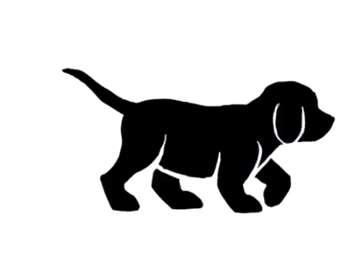

<h1 align="center">
  <br>
  <a href="https://github.com/ARCANGEL0/LarDoPet"></a>
  <br>
</h1>

<h4 align="center">Aplicativo para interação entre apaixonados por pets! <br> Doação, resgate e cuidados para animais.  </h4>

<p align="center">
  <a href="https://reactnative.dev">
    
  </a>
  <a href="https://api.whatsapp.com/send?phone=5513988504778"></a>
  <a href="#">
      
  </a>

  <a href="#">
      
  </a>
  <a href="https://www.petlove.com.br/doacoes">
    
  </a>
</p>

<p align="center">
  <a href="#lar-do-pet">Sobre o projeto</a> •
  <a href="#como-usar">Como usar</a> •
  <a href="#download">Download</a> •
  <a href="#contribuicao">Contribuição</a> •
  <a href="#links">Links</a> •
  <a href="#licenca">Licença</a>
</p>
&nbsp;&nbsp;&nbsp;

# Lar do pet 
  

<div style="display: flex; flex-direction: 'row';">

  
</div>
  <p style="">
    Este é um projeto para um aplicativo com intenção de facilitar e ajudar os animais e donos de pets em fornecer um lar e cuidados adequados para seus bichinhos.
    <br>
    O app irá possuir meios para criar anúncios de doações de animais, interação social com outras pessoas através de posts e chats, para publicar sobre animais perdidos ou resgatados, ou informativos e dicas para donos de pets, e um mapa com pontos salvos de veterinários, abrigos, petshops e doadores nas regiões.

   </p>


##### Algumas funcionalidades que irão estar no app &nbsp; :

* Poder usar a plataforma para doar ou adotar animais
* Publicar e anunciar animais perdidos na rua, para buscar o dono
* Postar e promover iniciativas com resgate de animais, ou informatizar donos de animais com dicas úteis
* Possuir um mapa indicando veterinários, petshops, abrigos e canis perto da sua localização
* Filtrar e buscar pets por tipo de animal e/ou região


<br><br>
# Como usar 

Para clonar o repo e utilizar o projeto, você precisa ter [Git](https://git-scm.com) e [Node.js](https://nodejs.org/en/download/) instalado no seu PC. 
Execute os seguintes comandos no terminal:

```bash
# Clone o repo
$ git clone https://github.com/ARCANGEL0/LarDoPet

# Vá para o diretório
$ cd LarDoPet

# Instale as dependências
$ npm install

# Inicie o projeto através do expo
$ expo start

# Se você possuir um emulador instalado, execute-o com expo usando run:android ou run:ios
$ expo run:android/ios

```


# Download 

<br><br>
##### Projeto ainda em desenvolvimento, assim que concluido irá ser liberado na AppStore e Playstore

<br><br>


# Links 

Alguns links úteis para quem possui pets

- [SUIPA](https://www.suipa.org.br)
- [Ampara animal](https://www.amparanimal.org.br)
- [Cão sem dono](http://www.caosemdono.com.br)
- [Petz](www.petz.com.br)
- [Instituto Luísa Mell](https://ilm.org.br)
- [Tudo de bicho](https://blog.tudodebicho.com.br)
- [Emporio das patas](https://blog.emporiodaspatas.com.br)

<br><br>


## Contribuição 

<p style="
  font-size: 1em;
  font-weight: bold;">
Apesar de ser apaixonado por animais e buscar fazer algo para ajudar pets a terem um lar e os devidos cuidados que merecem, estou fazendo este projeto inteiramente sozinho e sem intenções lucrativas. <br>
No entanto não tenho muito tempo para desenvolver o projeto, e qualquer ajuda externa seria muito bem recebida </p>

<a target="_onblank" href="https://github.com/ARCANGEL0/LarDoPet/pulls">
</a> &nbsp;&nbsp;&nbsp;
 


<br>


# Licença

[Licença GPLv3](https://github.com/ARCANGEL0/LarDoPet/blob/master/LICENSE)

---

>  [arcangelo.dev](https://arcangelo.dev) &nbsp;&middot;&nbsp;
>  [@ARCANGEL0](https://github.com/ARCANGEL0) &nbsp;&middot;&nbsp;
>   [contato@arcangelo.dev](mailto:contato@arcangelo.dev)
